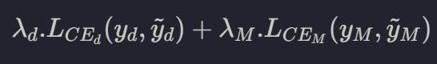

# Hierarchical Classification of Images

## Overview
This project is based on the implementation described in the paper "Making Better Mistakes: Leveraging Class Hierarchies with Deep Networks" (CVPR 2020) [1]. The base code has been adapted from the original work and extended to include additional experiments on learning rate schedulers and custom loss functions for hierarchical classification tasks.

## Dependencies
The main dependencies for this project are:
- Python 3.6
- PyTorch 1.1.0
- CUDA Toolkit 10.0
- NumPy
- TensorboardX
- TensorFlow
- NLTK
- PyYAML
- fastText (installed from GitHub)
- conditional

Additional dependencies are listed in the `environment.yml` file.

## Environment Setup
We use Conda to manage the environment. To set up the environment, follow these steps:

1. Ensure you have Anaconda or Miniconda installed.
2. Clone this repository and navigate to the project directory.
3. Create the environment using the provided `environment.yml` file:
   ```bash
   conda env update -n my-env -f environment.yml
   ```
4. Activate the environment:
   ```bash
   source activate my-env
   ```

## Dataset
We use the CIFAR-100 dataset for image classification.

download from:
https://www.kaggle.com/datasets/fedesoriano/cifar100

## Running the Experiments
### NEF cluster
To run experiments on the NEF cluster, you need to submit jobs using a script. Here's an example of a job script:
```bash
#!/bin/bash
#
# Submission script for Soft labels embedding program
module load gcc/9.2.0 conda/2021.11-python3.9 cuda/9.1 cudnn/7.0-cuda-9.1
conda env update -n my-env -f environment.yml
source activate my-env
python model_train.py
```

then to run this job :
```bash
oarsub -p "gpu='YES' and host='nefgpu51.inria.fr'" -l /nodes=1,walltime=24:00:00 -S ./script
```
Availabilities for each node are in :
https://nef-frontal.inria.fr/monika

### Comparative Analysis: Bertinetto et al.'s 'Making Better Mistakes' vs. Barz & Denzler's 'Hierarchy-based Image Embeddings'
the results and explanation of the analysis are in [./comparison](./comparison/)
To run for example the hierarchical loss experience for a given α you can use the command:
```bash
python main.py --architecture plainnet --loss hierarchical-cross-entropy --epochs 180 --alpha 0.1
```

### Learning Rate Schedulers
Three types of learning rate schedulers have been implemented:
1. Cosine Annealing with Warm Restarts (SGDR): `--lr_schedule cosine`
2. Cyclic Learning Rate: `--lr_schedule cyclic`
3. Multi-Step Learning Rate: `--lr_schedule cutout`

More in [./learning_rate](./learning_rate/)

 you can use the `--lr_schedule` argument to choose your learning rate
## Custom Loss Function
The SimpleHierarchyLoss combines fine-grained and coarse-grained classification losses, with controls for their relative importance and when they're introduced during training:

- `lambda_fine`: Weight for the fine-grained loss (100 classes in CIFAR-100). 
  Default: 1.0

- `lambda_coarse`: Weight for the coarse-grained loss (20 superclasses in CIFAR-100). 
  Default: 1.0

- `fine_loss_start_epoch`: Epoch to start applying fine-grained loss. 
  Default: 0

- `fine_loss_ramp_epochs`: Number of epochs to gradually increase fine-grained loss to full weight. 
  Default: 0

- `coarse_loss_start_epoch`: Epoch to start applying coarse-grained loss. 
  Default: 0

- `coarse_loss_ramp_epochs`: Number of epochs to gradually increase coarse-grained loss to full weight. 
  Default: 0

<p align="center">
  
</p>
Example usage:
```bash
python main.py --architecture ResNet18 --loss simple-hierarchy --lr_schedule cutout --epochs 180 --lambda_fine 1 --lambda_coarse 0.5 --coarse_loss_start_epoch 50 --coarse_loss_ramp_epochs 20 --fine_loss_start_epoch 0 --fine_loss_ramp_epochs 0
```


## Results
Results of the experiments, including training and validation losses, accuracies, and hierarchical metrics, are saved in JSON format in the specified output folder. Each epochs results are also saved.

## References
[1] Luca Bertinetto*, Romain Mueller*, Konstantinos Tertikas, Sina Samangooei, Nicholas A. Lord*. "Making Better Mistakes: Leveraging Class Hierarchies with Deep Networks". IEEE Conference on Computer Vision and Pattern Recognition (CVPR) 2020. Source code: https://github.com/fiveai/making-better-mistakes

[2] Björn Barz and Joachim Denzler. "Hierarchy-based Image Embeddings for Semantic Image Retrieval". IEEE Winter Conference on Applications of Computer Vision (WACV), 2019. Source code: https://github.com/cvjena/semantic-embeddings
