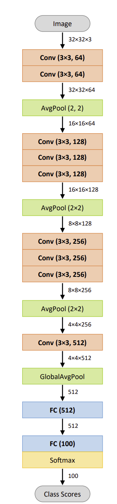
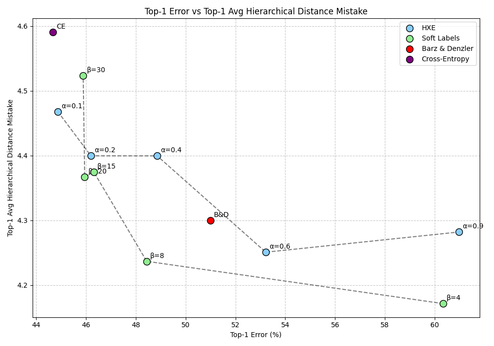
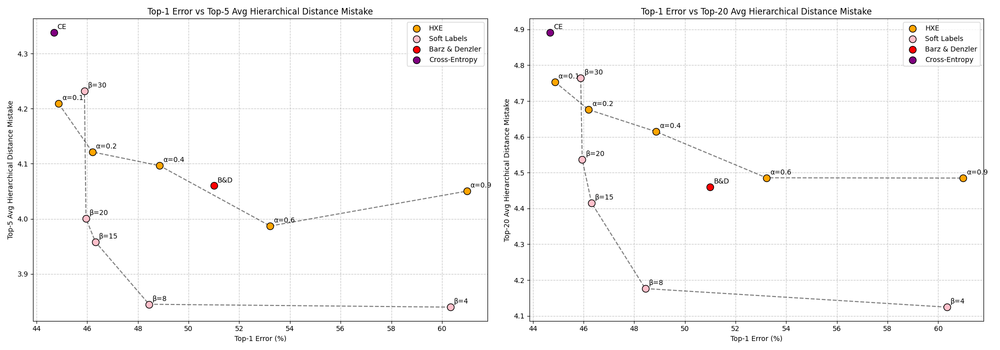
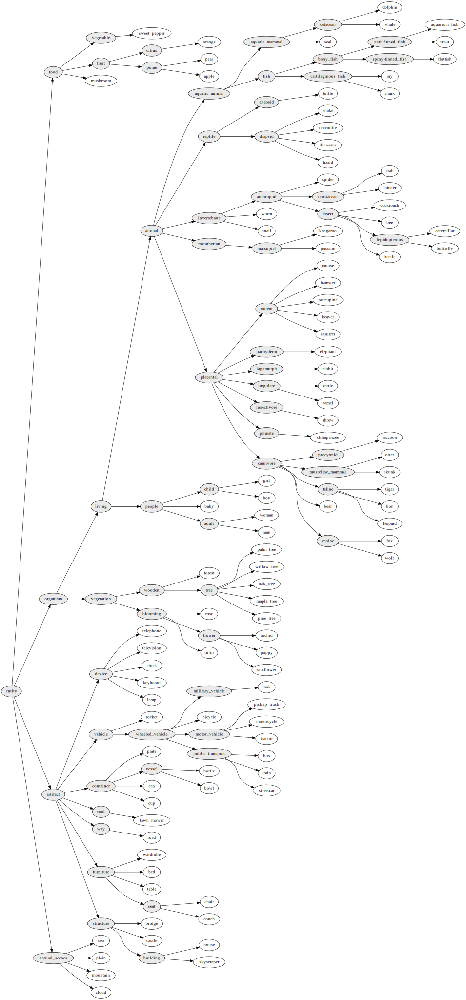

# Comparative Analysis: Bertinetto et al.'s 'Making Better Mistakes' vs. Barz & Denzler's 'Hierarchy-based Image Embeddings'

## Dataset choice

CIFAR-100 was chosen for all the experiments done for this comparison, due to its availability and its smaller size compared to the other datasets used in the two papers (ImageNet, iNaturalist'19). The hierarchy is extracted through a WordNet-based taxonomy proposed by Barz and Denzler [2] [cifar hierarchy](./Cifar-Hierarchy).

## Hierarchical structure

Due to Barz and Denzler [2] already performing experiments on the Cifar dataset, my task was to get Cifar to work on the code base of the making better mistakes paper [1]. To do that, we need to conform to the hierarchy structure used, which is an nltk Tree object in contrast to the child-parent dictionaries computed in the Semantic Embeddings paper. We also have to compute the LCA (lowest common ancestor) distances in order to compute the hierarchical loss, as well as for hierarchical metrics calculations. The scripts for this conversion are in [Cifar hierarchy scripts](./data/scripts_asis/).

## Architecture used

The architecture used is one of the ones tested in Barz and Denzler [2]. It's a Plainet-11, a VGG-like architecture introduced by Barz and Denzler [3] adapted for quicker experiments compared to the other deep neural networks tested (resnet-x, pyramidnet...). 

  

While Barz and Denzler [2] achieved 74% accuracy on CIFAR-100, I've only managed around 55%. This difference is due to differences in the training process. Unlike Barz and Denzler's use of SGD with warm restarts and cosine annealing over 372 epochs, I trained with a fixed learning rate for only 25 epochs. This significant reduction in training time and lack of learning rate optimization likely accounts for the performance gap.

## Methods

### Hierarchical Cross Entropy (HXE)

Hierarchical cross entropy is computed using the following formula [1]:

$$L_{HXE}(p,C) = -\sum_{l=0}^{h-1}{\lambda(C^{(l)})log(p(C^{(l)} \mid C^{(l+1)}))}$$

- where $\lambda(C^{(l)})$ is the weight associated with the edge node $C^{(l+1)} \rightarrow C^{(l)}$
- $\lambda(C) = exp(-\alpha h(C))$ where $\alpha$ is a parameter that controls the extent to which information is discounted down the hierarchy.

Key characteristics of this loss function include:

- The parameter $\alpha$ controls how much the model prioritizes hierarchical accuracy. Larger $\alpha$ values place more emphasis on avoiding mistakes between distant classes in the hierarchy.
- When $\alpha$ is set to 0, HXE becomes equivalent to standard cross-entropy, treating all misclassifications equally regardless of hierarchical distance.
- By adjusting $\alpha$, users can balance between optimizing for top-k accuracy and hierarchical accuracy. Higher $\alpha$ values tend to improve hierarchical metrics at the potential expense of top-k accuracy.

### Soft Labels

Soft labels are implemented according to the formula [1]:

  

The soft labels approach uses a hyperparameter β to control label mass distribution. As β decreases from 30 to 4 (the experimental range), it shifts label mass away from the ground truth towards neighboring classes in the hierarchy. This affects the entropy of the label distribution, with β → ∞ corresponding to standard one-hot encoding, and β = 0 resulting in a uniform distribution across all classes.

### Barz & Denzler Method

The Barz & Denzler method creates class embeddings based on semantic similarity in a hierarchy [2].

Semantic Similarity Measure:
$s_G(u,v) = 1 - d_G(u,v)$, where $d_G(u,v) = \frac{\text{height}(\text{lcs}(u,v))}{\max_{w \in V} \text{height}(w)}$ and $\text{lcs}(u,v)$ is the lowest common subsumer of $u$ and $v$.

Class Embedding Algorithm:
Compute class embeddings $\phi(c_i)$ such that $\phi(c_i)^T \phi(c_j) = s_G(c_i, c_j)$ and $|\phi(c_i)| = 1$.

Image-to-Embedding Mapping:
Train a CNN $\psi$ to map images onto these class embeddings using a correlation loss:
$$L_{\text{CORR}}(B) = \frac{1}{m} \sum_{b=1}^m (1 - \psi(I_b)^T \phi(c_{y_b}))$$,
where $B$ is a batch of $m$ images $I_b$ with labels $y_b$.

## Results

  

All the hierarchical methods provide better results hierarchy-wise than the standard cross entropy. Let's examine the performance of each method:

- Standard Cross Entropy

The standard cross entropy serves as our baseline. While it achieves competitive top-1 accuracy, it performs the worst in terms of hierarchical metrics. This is expected, as it doesn't take the class hierarchy into account during training.

- Hierarchical Cross Entropy (HXE)

HXE shows a clear trade-off between top-1 accuracy and hierarchical performance as α increases. With low α values, it behaves similarly to standard cross entropy. As α increases, we observe improved hierarchical metrics at the cost of some top-1 accuracy. This method provides a flexible way to balance between conventional and hierarchical accuracy.

- Soft Labels

The soft labels approach demonstrates a similar trade-off to HXE, controlled by the β parameter. As β decreases, we see improved hierarchical performance with some loss in top-1 accuracy. This method appears to achieve a good balance, especially for mid-range β values, offering improvements in hierarchical metrics without sacrificing too much top-1 accuracy.

- Barz & Denzler Method

The Barz & Denzler method demonstrates a clear trade-off in hierarchical classification tasks. While it achieves lower test accuracy compared to the soft labels approach, it shows competitive performance on hierarchical metrics. This makes the method particularly suitable for scenarios where hierarchical performance is prioritized over conventional accuracy.

- Comparative Analysis

1. Top-1 Error vs. Top-1 Hierarchical Distance: All hierarchical methods show improvements over standard cross entropy. HXE and soft labels offer a spectrum of trade-offs, while Barz & Denzler provides a fixed point with strong hierarchical performance but higher top-1 error.

2. Top-5 and Top-20 Performance: The improvements in hierarchical metrics are even more pronounced when considering top-5 and top-20 predictions. This suggests that these methods are particularly effective at pushing semantically similar classes higher in the ranking, even if they don't always get the top-1 prediction correct.

3. Method Selection: The choice between these methods depends on the specific requirements of the task:
   - If maintaining high top-1 accuracy is crucial, soft labels or HXE with low α/high β values are preferable.
   - For applications where minimizing semantic mistakes is paramount, Barz & Denzler or HXE/soft labels with high α/low β values are more suitable.
   - For a balance between conventional and hierarchical accuracy, mid-range parameters for HXE or soft labels offer good compromises.

In summary, these results demonstrate that incorporating hierarchical information into the learning process can lead to significant improvements in the semantic quality of predictions, often with only a small trade-off in conventional accuracy metrics.

## References

[1] **Making Better Mistakes: Leveraging Class Hierarchies with Deep Networks**
    Luca Bertinetto*, Romain Mueller*, Konstantinos Tertikas, Sina Samangooei, Nicholas A. Lord*.
    IEEE Conference on Computer Vision and Pattern Recognition (CVPR) 2020.
    Source code: https://github.com/fiveai/making-better-mistakes

[2] **Hierarchy-based Image Embeddings for Semantic Image Retrieval**
    Björn Barz and Joachim Denzler.
    IEEE Winter Conference on Applications of Computer Vision (WACV), 2019.
    Source code: https://github.com/cvjena/semantic-embeddings

[3] **Deep Learning is not a Matter of Depth but of Good Training**
    Björn Barz and Joachim Denzler.
    International Conference on Pattern Recognition and Artificial Intelligence (ICPRAI), 2018.
    https://pub.inf-cv.uni-jena.de/pdf/Barz18:GoodTraining.pdf
    
## Appendix
### Cifar wordNet based hierarchy

