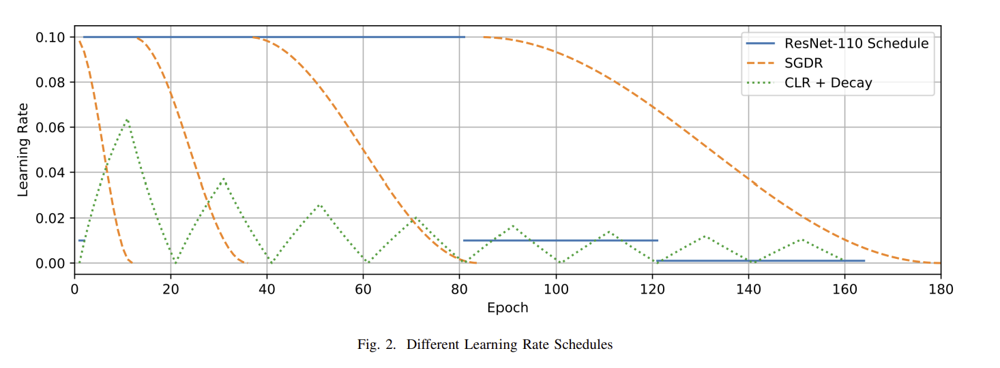

# Comparing Learning Rate Schedules: CLR and SGDR

## Background

Both CLR and SGDR aim to improve optimization speed and final model performance by dynamically adjusting the learning rate during training.

## A. Cyclical Learning Rates (CLR)

CLR, introduced by Smith (2015), cycles the learning rate between a minimum and maximum value. The learning rate clr(t) at iteration t is given by:

$$clr(t) = lr_{min} + (lr_{max} - lr_{min}) \cdot \left(1 - \left|\frac{t}{s} - 2\left\lfloor\frac{t}{2s}\right\rfloor - 1\right|\right)$$

Where:
- lr_min and lr_max are the minimum and maximum learning rates
- s is the step size (number of iterations in half a cycle)

CLR can also incorporate a global learning rate decay:

$$clr(\tilde{t}) = clr(t) \cdot \frac{1}{1 + (\delta - 1) \cdot \frac{t}{t_{max}}}$$

Where:
- t_max is the maximum number of iterations
- δ is the factor by which the maximum learning rate is reduced at the end of training

## B. Stochastic Gradient Descent with Warm Restarts (SGDR)

SGDR, introduced by Loshchilov & Hutter (2017), uses cosine annealing with periodic restarts. The learning rate sgdr(ε) during epoch ε is given by:

$$sgdr(\epsilon) = lr_{min} + \frac{1}{2}(lr_{max} - lr_{min})\left(1 + \cos\left(\frac{\pi i}{S_i}\right)\right)$$

Where:
- lr_min and lr_max are the minimum and maximum learning rates
- S_i is the length of the current cycle
- i is the number of epochs since the beginning of the cycle

The length of each cycle increases by a factor σ:

$$S_i = \sigma \cdot S_{i-1}$$

Key benefits of both approaches:
- Faster initial convergence from high initial learning rate
- Escaping local optima through periodic learning rate increases
- Fine-tuning with small learning rates between peaks

## Custom Loss

The AncestralPenaltyLoss L(y, ŷ) for a batch of N samples is defined as:

$$L(y, \hat{y}) = L_{CE}(y, \hat{y}) + \lambda \cdot \frac{1}{N} \sum_{i=1}^N D_A(y_i, \hat{y}_i)$$

Where:
- $L_{CE}(y, ŷ)$ is the standard cross-entropy loss
- λ is the penalty factor (hyperparameter)
- $D_A(y_i, ŷ_i)$ is the ancestral distance between the true class y_i and predicted class ŷ_i

The ancestral distance $D_A$ is calculated as:

$$D_A(y_i, \hat{y_i}) = |\text{ancestors}(y_i) \cup \text{ancestors}(\hat{y_i})| - |\text{ancestors}(y_i) \cap \text{ancestors}(\hat{y_i})|$$

Where:
- ancestors(c) is the set of ancestors for class c in the hierarchy
- |·| denotes the number of elements in a set

This loss function adds a penalty based on the hierarchical distance between the true and predicted classes, encouraging the model to make predictions that are "closer" in the class hierarchy when exact classification fails.

## References

1. Smith, L. N. (2015). Cyclical learning rates for training neural networks. arXiv preprint arXiv:1506.01186.
2. Loshchilov, I., & Hutter, F. (2017). SGDR: Stochastic Gradient Descent with Warm Restarts. ICLR 2017.
